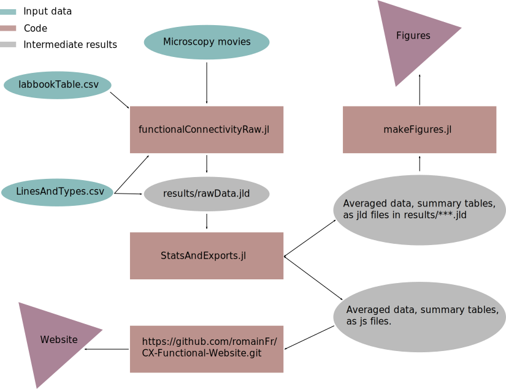

[](https://mybinder.org/v2/gh/romainFr/CX-Functional-Analysis/master)

# CX-Functional-Analysis
Code and instructions to reproduce all the analysis used to generate the figures in the article [Building a functional connectome of the Drosophila central complex (Franconville, Beron, Jayaraman)](https://www.authorea.com/155729/_TsHpd9reMuWijjossgt6Q) and the tables underlying the associated [website](https://romainfr.github.io/CX-Functional-Website/). All steps of the analysis are demonstrated in 3 notebooks (in the ```notebooks``` folder) that can be run [here](https://mybinder.org/v2/gh/romainFr/CX-Functional-Analysis/master) thanks to [Binder](https://mybinder.org/).

## Installation, prerequesites
To run the analysis locally (recommended if you plan of analyzing a full dataset)
- Download and install [Julia](https://julialang.org/downloads/)
- Install the packages specified in the REQUIRE file (using ```Pkg.add("PkgName1","PkgName2",...)```)
- At the Julia prompt, type :
```julia
  Pkg.add("PlotlyJS")
```
- Download or clone this repository.
- Data is stored in [this OpenScienceFramework page](https://osf.io/vsa3z/). Notebooks contain instructions to download it directly from ```Julia```.

## Content, analysis pipeline

The table ```LinesAndTypes.csv``` is identical to ```Table 1``` of the paper and contains information about cell types and innervation patterns of the driver lines used in the study.
The table ```labbookTable.csv``` is, well, a labbook (all the metadata necessary to run the analysis). Each row corresponds to one fly.

The ```code``` folder contains three scripts (mirrored in the three notebooks in the ```notebooks``` folder), all meant to be run from the ```CX-Functional-Analysis``` folder :
- ```functionalConnectivityRaw.jl``` does the movement correction, ROI detection and computes the fluorescence traces from the raw data and returns the ```rawData.jld``` file (JLD is Julia's binary format) containing a Dictionary, with one entry per fly. The script takes command line arguments : the first one is the path to where the data is located on your computer. An arbitrary number of extra arguments can be passed to specify which experimental day one want to analyze. For example ```julia code/functionalConnectivityRaw.jl data/full/ jun1315 jun1415``` would analyze two days of experiment, assuming the data is present in the ```data/full/``` folder. 
- ```StatsAndExports.jl``` computes the statistics and summaries from the ```results/rawData.jld``` file and returns them as a series of ```jld``` (for figure making) and ```js``` (for the website) files. Notebook coming soon. 
- ```makeFigures.jl``` does what you would expect. Notebook coming soon.

The workflow is schematized as : 
 

